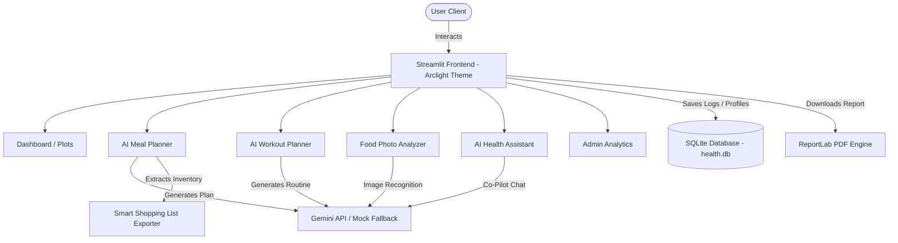

# 🥗 NutriAI Pro

> **Intelligent Health & Nutrition Management Platform**

NutriAI is a comprehensive, production-ready AI-powered health management platform designed to help users track calories, generate personalized AI meal and fitness plans, analyze food photos with computer vision, track sleep cycles, and consult an AI nutrition coach. 

The application is styled with the premium **Arclight Dark Luxury** design system (Champagne Gold `#E5C483` accents, editorial *Cormorant Garamond* headers, and 28px rounded glassmorphism cards). It runs out of the box with a built-in Mock Mode fallback if a Google Gemini API key is not supplied.

---

## 📊 System Architecture



---

## 🌟 Core Features

<details>
<summary><b>🔐 User Authentication & Secure Profiles</b></summary>

- **PBKDF2 Password Hashing**: Registration and login secured using random salts and 100,000 hashing iterations.
- **Tailored Metrics**: Track age, height, weight, activity multipliers, goal indexes, dietary preferences, and experience levels.
- **Badge Engine**: Automatically awards credentials (e.g., *Nutrition Architect*) for healthy streaks.
</details>

<details>
<summary><b>🏠 Interactive Health Dashboard</b></summary>

- **Target vs. Intake**: Live calculations of remaining targets, calorie deficits, and water logs.
- **Body Metrics**: Calculate BMI, Basal Metabolic Rate (BMR), and Total Daily Energy Expenditure (TDEE).
- **Macro Visualizations**: Responsive Plotly donuts illustrating daily Protein, Carbs, and Fat ratios.
- **Weight History**: Interactive line graphs charting fitness progress.
</details>

<details>
<summary><b>🍽️ AI Meal Planner & Smart Shopping list</b></summary>

- **Tailored Schedules**: Generates **Daily**, **Weekly**, or **Monthly** plans matching health targets.
- **Strict Plan Formatting**: Uniform structures for Breakfast (🌅), Lunch (☀️), Dinner (🌙), and Snacks (🍌) with calorie counts, portion estimates, macros, and ingredients list.
- **Cost Estimator**: Smart Shopping list automatically compiles ingredients, estimates items pricing, and supports **CSV** / **PDF** downloads.
</details>

<details>
<summary><b>📷 Computer Vision Food Analyzer</b></summary>

- **Photo Analytics**: Upload photos of meals (PNG/JPG) to analyze ingredients, caloric values, macronutrients, and health ratings.
- **Improvement Tips**: Generates recommendations to lower fats or add fibers to logged items.
</details>

<details>
<summary><b>🏋️ Exercise & Fitness Coach</b></summary>

- **Workout Builder**: Custom routines by category (Gym, Home, Yoga, HIIT) with target sets, reps, duration, and rests.
- **Conversational Health Assistant**: Maintains conversation history in a chat coach window powered by Gemini to request alternatives, recipes, and instructions.
</details>

<details>
<summary><b>📊 Wearables, Sleep & Reports</b></summary>

- **Wearable Syncing**: Mockup toggles for Fitbit and Apple Health data syncs.
- **Sleep Quality Tracker**: Logs sleep cycles and duration, displaying sleep scores and coach warnings.
- **PDF Exporter**: Beautifully formatted multi-page PDF summary reports generated locally via the *ReportLab* publishing engine.
</details>

<details>
<summary><b>🛠️ Administrative Control Panel</b></summary>

- **Access Guard**: Only accessible to users logged in with username `"admin"`.
- **System Metrics**: Live CPU, memory usage stats, and API statistics.
- **Cascading User Deletion**: Delete users row-by-row, wiping database profiles, chat logs, and meal plans.
- **Database Maintenance**: Selectable database record purging controls (30, 60, or 90 days).
</details>

---

## 🎨 Design System: Arclight Dark Luxury

NutriAI features a bespoke, premium design language:
* **Background Canvas**: Slate Dark-Navy (`#05070B`) layered with glowing golden radial spotlight halos.
* **Cards**: Large rounded `28px` slate-navy solid cards (`#0C0F1A`) with thin translucent gold borders (`rgba(229,196,131,0.08)`).
* **Typography**: Imported serif headers (*Cormorant Garamond*) paired with clean body text (*Plus Jakarta Sans*).
* **Buttons**: Luxury Champagne Gold (`#E5C483`) with charcoal text and custom rise hover animations.

---

## 📂 Project Directory structure

```plaintext
NutriAI/
├── app.py                      # Application Entry Point & Programmatic Routing
├── database.py                 # SQLite Schema Setup & thread-safe CRUD Functions
├── auth.py                     # User Sessions, Registration & Hashing Functions
├── config.py                   # Folder initialization & Generative AI configuration
├── requirements.txt            # Project Dependencies
├── Dockerfile                  # Container Deployment Configuration
├── .gitignore                  # Git excludes file (ignoring caches, .env, and health.db)
├── .dockerignore               # Docker build excludes file
├── .env                        # Local Environment Secrets Configuration
│
├── pages/                      # Multi-Page Streamlit App Files
│   ├── login.py                # Login Interface
│   ├── register.py             # User Signup Interface
│   ├── dashboard.py            # User Health Dashboard & Plots
│   ├── meal_planner.py         # AI Meal Planner & Shopping List compilation
│   ├── food_analyzer.py        # Food Image Recognition and Logging
│   ├── fitness.py              # Workout Planner Routine Builder
│   ├── chatbot.py              # AI Health Assistant Chat Interface
│   ├── reports.py              # PDF Compilation & CSV Downloads
│   ├── settings.py             # Profile, Sleep Logs, Wearables, notifications
│   └── admin.py                # Admin Statistics & Resource Telemetry
│
├── modules/                    # Core Calculations and Third-party APIs
│   ├── gemini_service.py       # Live Gemini API standardizer & 100% Mock Fallbacks
│   ├── bmi_calculator.py       # BMI, BMR, TDEE, Health Score Equations
│   └── report_generator.py     # PDF & CSV Exporters (ReportLab & Pandas)
│
├── database/
│   └── health.db               # SQLite database file (created automatically)
├── assets/                     # Media & asset caches
└── exports/                    # Compiled PDF downloads cache
```

---

## 🚀 Installation & Setup

### Local Run

Ensure Python 3.10+ is installed on your local computer.

1. **Clone or Navigate to the Workspace**:
   ```bash
   cd C:\Users\USER\.gemini\antigravity\scratch\NutriAI
   ```

2. **Create and Activate a Virtual Environment**:
   ```bash
   python -m venv venv
   # On Windows (Powershell)
   .\venv\Scripts\Activate.ps1
   # On Linux/macOS
   source venv/bin/activate
   ```

3. **Install Dependencies**:
   ```bash
   pip install -r requirements.txt
   ```

4. **Configure Secrets**:
   Open the `.env` file and enter your Google Gemini API Key:
   ```env
   GEMINI_API_KEY=your_actual_api_key_here
   DB_PATH=database/health.db
   ```
   *Note: If `GEMINI_API_KEY` is left blank, the application automatically activates **Mock Mode** for all AI modules, populating realistic sample routines so you can test the platform with full stability.*

5. **Run the Streamlit Application**:
   ```bash
   streamlit run app.py
   ```

---

### 🐳 Running with Docker

Build and run the platform in an isolated container environment:

1. **Build the Container Image**:
   ```bash
   docker build -t nutriai-app .
   ```

2. **Run the Container**:
   Map port 8501 of your host machine to port 8501 of the container.
   ```bash
   docker run -d -p 8501:8501 --env-file .env --name nutriai-container nutriai-app
   ```

3. **Access the App**:
   Navigate to: `http://localhost:8501`

---

## 🔒 Security Practices

- **Password Hashing**: Passwords are securely hashed with a unique random salt using Python's PBKDF2-HMAC-SHA256 algorithm (100,000 iterations). Raw passwords are never stored.
- **Environment Variables**: Credentials, database paths, and API keys are stored in a `.env` file, which is excluded from commits via `.gitignore`.
- **API Protection**: User inputs to AI models are validated and formatted cleanly. SQLite handles connections with parameterized bindings to block SQL injection.
